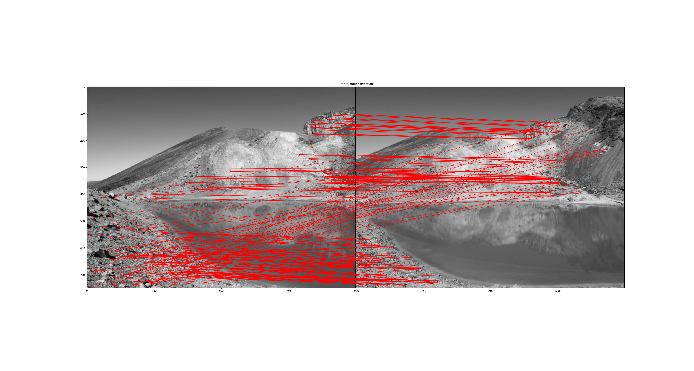

# COMPSCI 773 Assignment 1: Berg, N. & Loh, N.

##Phase Two Extraction of Descriptors and Matching

<table>
  <tr>
    <th>Name</th>
    <th>Email</th>
    <th>Github Username</th>
    <th>Student Number</th>
  </tr>
  <tr>
    <td>Nicholas Berg</td>
    <td> nber106@aucklanduni.ac.nz </td>
    <td>133caesium</td>
    <td>579246262</td>
  </tr>
  <tr>
    <td>Neville Loh</td>
    <td>nloh108@aucklanduni.ac.nz</td>
    <td>Neville-Loh</td>
    <td>737025829</td>
  </tr>
</table>

## Requirement
Python 3.8 or above, for dependancy, please refer to requirement.txt

## How to run


## Linux/Mac
```
python3 CS773StitchingSkeleton.py

```

## Windows
```
python CS773StitchingSkeleton.py

```


## Results:

###Main Task: Normalized Cross Correlation (NCC) based brute force matching using a precomputed axis-aligned descriptor.




###Extension 1: Optimisation of the NCC Matching
We performed a number of performance optimisations to decrease runtime of our NCC. 
Additionally, using the intuition that our panoramas would be unlikely to experience drastic rotation around the z axis, 
we made the assumption that the length and gradiant of the lines connecting features should be tightly distributed. We used 
statistical anaylsis to design a filtering step which significiantly improves signal to noise (reducing false positive matches without
reducing true positive matches). Additionally, we combined our low level implementation of NCC with an existing implementation of NCC
based on Solem (2012)'s Computer Vision textbook. Finally, we performed "sanity checks" by testing our system on three different pairs of images, 
and checking the extent to which unrelated images would be mapped, or similarly the extent to which two identical images are mapped. Lines have been plotted in distinct colour to better visually
identify true and false positive matches.


###Extension 2: Comparison with HOG feature detector.
As our second extension, we researched implementations of Histogram of Oriented gradients, and combined and modified 
existing implementations of the HOG feature detector to fit into our workflow, allowing comparison
with our existing image sets. 


###Extension 3: Comparison with SIFT feature detector.
As our third extension, we utilised the VLFeat open source library to more easily implement a SIFT feature detector. 
This implementation was used to perform the same tests as our two NCC implementations and HOG implementation, for a comparison
of different feature detectors across a common image set.


