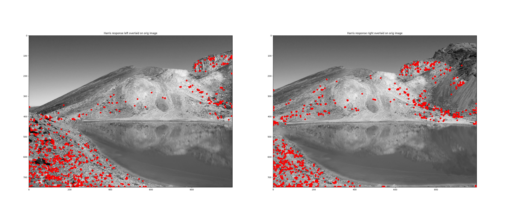

# COMPSCI 773 Assignment 1: Berg, N. & Loh, N.

<table>
  <tr>
    <th>Name</th>
    <th>Email</th>
    <th>Github Username</th>
    <th>Student Number</th>
  </tr>
  <tr>
    <td>Nicholas Berg</td>
    <td> nber106@aucklanduni.ac.nz </td>
    <td>50</td>
    <td>579246262</td>
  </tr>
  <tr>
    <td>Neville Loh</td>
    <td>nloh108@aucklanduni.ac.nz</td>
    <td>Neville-Loh</td>
    <td>737025829</td>
  </tr>
</table>

## Current state:

This simple code skeleton is a starting point for the CompSci 773 2022 practical assignment on image stitching. 

Please note that you can also use numpy as a representation for 2D images, this will be beneficial in terms 
of more efficient computations. The examples here are implemented using a list of lists representation for image arrays, 
which is very inefficient!

Numpy also provides convolution and other functions which you may want to use.

Note: if you make heavy use of higher level OpenCV functions, this will lead to lower marks. We want you to implement
necessary steps of the algorithms on your own (without having to reinvent convolutions).

Practice: Use a virtual environment for developing. This way you can use dependencies like matplotlib or numpy in a
clean environment dedicated to this assignment. 

Here is a link to a file giving some hints and tips regarding developing and the use of numpy:
https://www.cs.cornell.edu/courses/cs5670/2021sp/resources/cs5670_python_debugging_and_numpy.pdf
